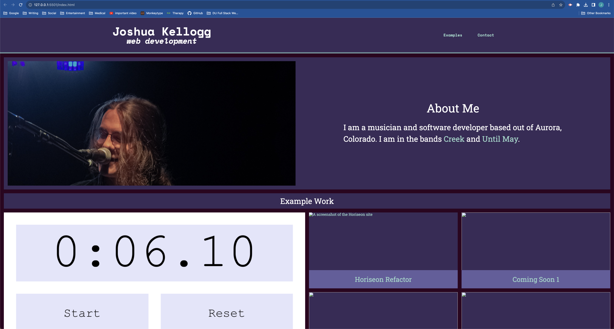

# Challenge: Portfolio Project

The challenge project for Module 2 of the DU Full Stack Flex Bootcamp was to create a portfolio site.

## Description

This project includes:
- a sticky header with functional navigation links including one that links directly to my email
- an About Me section with an image that scales to keep the section from feeling "naked" on any display size (whether or not I accomplished this is, perhaps, up for debate)
- a spotlight section to highlight my past projects
- a footer showing that I created the project

## Usage

The deployed site can be found [here](https://jkellogg01.github.io/module-2-challenge/)

## Credit

This site uses Eric Meyer's CSS reset, found [here](https://meyerweb.com/eric/tools/css/reset/index.html_).
Aside from that, all code is my own.
